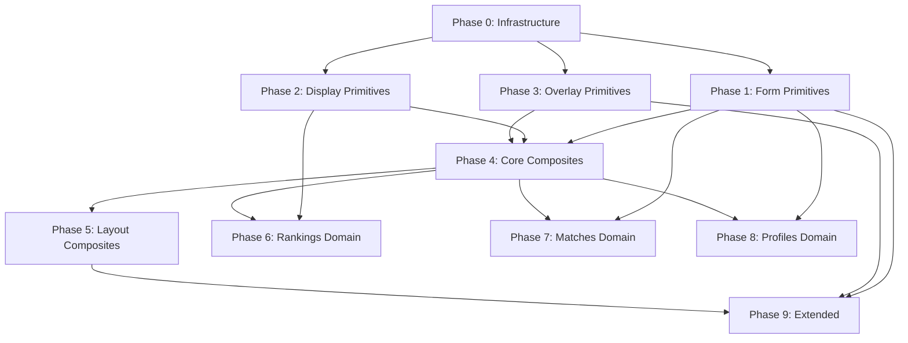

# Component Build Plan

Phased build order for all UI components. Each phase depends only on prior phases — no forward references.

**Total**: ~50 components across 10 phases (0–9).

**Layers**:
- `components/ui/` — Layer 1: shadcn/ui primitives, themed to Court palette
- `components/` — Layer 2: Composites, app-agnostic patterns
- `components/domain/` — Layer 3: Domain-specific (pyramid, matches, players)

**Rules** (from `docs/design-system.md`):
- Pages import only from `components/domain/` and `components/` — never `components/ui/`
- Domain components import from `components/` and `components/ui/`
- Composites import only from `components/ui/`
- Primitives never import from other layers

---

## Phase 0: Infrastructure

**Goal**: Storybook + Tailwind theme ready before any components.

| Task | Details |
|------|---------|
| Storybook | Install `@storybook/nextjs`, configure for Next.js 14 App Router |
| Tailwind tokens | Add `court-*` and `trophy-*` color scales to `tailwind.config.ts` |
| Font | Inter (Google Fonts) — configure in Storybook preview + `app/layout.tsx` |
| Dark mode | `darkMode: "class"` in Tailwind, toggle decorator in Storybook |
| Viewports | Mobile (375×812) + Desktop (1440×900) viewport presets |
| Script | `pnpm storybook` in `package.json` |

**Deliverables**: `pnpm storybook` launches with empty canvas, theme tokens work in stories.

---

## Phase 1: Primitives — Form & Text (7 components)

**Layer**: `components/ui/`
**Dependencies**: Phase 0 only

| # | Component | File | shadcn source | Key customization | Story variants |
|---|-----------|------|--------------|-------------------|----------------|
| 1 | Button | `ui/button.tsx` | `button` | 4 variants (primary/outline/destructive/ghost), `court-500` primary, `rounded-xl`, tactile press (`active:shadow-none`) | All variants × sizes, disabled, loading spinner, with icon (left/right), as link (`href`) |
| 2 | Input | `ui/input.tsx` | `input` | `rounded-xl`, `ring-1 ring-slate-300`, `focus:ring-2 focus:ring-court-500` | Default, error state (red ring), disabled, with placeholder |
| 3 | Textarea | `ui/textarea.tsx` | `textarea` | Same ring/focus as Input | Default, error, disabled, with char count |
| 4 | Label | `ui/label.tsx` | `label` | Standard | Default, with required indicator (`*`) |
| 5 | Select | `ui/select.tsx` | `select` | Native on mobile, Radix on desktop, `rounded-xl` | With options, placeholder, disabled |
| 6 | Checkbox | `ui/checkbox.tsx` | `checkbox` | `court-500` checked state | Checked, unchecked, disabled, with label |
| 7 | Switch | `ui/switch.tsx` | `switch` | `court-500` active track | On, off, disabled, with label |

---

## Phase 2: Primitives — Display (7 components)

**Layer**: `components/ui/`
**Dependencies**: Phase 0 only

| # | Component | File | Key customization | Story variants |
|---|-----------|------|-------------------|----------------|
| 8 | Badge | `ui/badge.tsx` | 5 semantic variants: win (`court-100`/`court-700`), loss (`red-100`/`red-700`), pending (`trophy-100`/`trophy-700`), rank (`trophy-500`/`white`), info (`sky-100`/`sky-700`). `rounded-full` | All 5 variants, sizes (sm/default) |
| 9 | Avatar | `ui/avatar.tsx` | Initials fallback, `rounded-full`, optional status ring (green=available, orange=challenged, slate=unavailable) | With image, initials only, all sizes (sm/md/lg/xl), with status ring |
| 10 | Separator | `ui/separator.tsx` | `bg-slate-200 dark:bg-slate-800` | Horizontal, vertical |
| 11 | Skeleton | `ui/skeleton.tsx` | `animate-pulse` 1.5s, `bg-slate-200 dark:bg-slate-800`, `rounded-xl` | Text line, circle, card shape, custom dimensions |
| 12 | Tabs | `ui/tabs.tsx` | `court-500` active underline/bg, `text-slate-600` inactive | 2 tabs, 4 tabs, with content panels |
| 13 | Tooltip | `ui/tooltip.tsx` | `bg-slate-900 text-white` (light), `bg-slate-100 text-slate-900` (dark), `rounded-lg`, `shadow-md` | Text tooltip, with icon trigger, long content |
| 14 | Scroll Area | `ui/scroll-area.tsx` | Styled scrollbar thumb (`slate-300`) | Vertical scroll, horizontal scroll |

---

## Phase 3: Primitives — Overlay (6 components)

**Layer**: `components/ui/`
**Dependencies**: Phase 0 only (but Dialog + Sheet are prerequisites for Phase 4's ResponsiveDialog)

| # | Component | File | Key customization | Story variants |
|---|-----------|------|-------------------|----------------|
| 15 | Dialog | `ui/dialog.tsx` | Desktop centered, `shadow-xl`, `rounded-2xl`, backdrop `bg-black/50` | Simple content, with form, with action buttons, scrollable |
| 16 | Sheet | `ui/sheet.tsx` | Bottom sheet, `rounded-t-3xl`, drag handle, `shadow-xl` | From bottom with content, scrollable, with close button |
| 17 | Dropdown Menu | `ui/dropdown-menu.tsx` | `shadow-md`, `rounded-xl`, `ring-1 ring-slate-200` | Simple items, with icons, with sections/separators, with destructive item |
| 18 | Toast (Sonner) | `ui/sonner.tsx` | Snappy 150ms enter, `rounded-xl`, semantic colors (success=court, error=red, info=sky) | Success, error, info, with action button, with description |
| 19 | Popover | `ui/popover.tsx` | `shadow-md`, `rounded-xl`, `ring-1 ring-slate-200` | Simple content, with form content, positioned (top/bottom/left/right) |
| 20 | Calendar | `ui/calendar.tsx` | `court-500` selected day, `court-50` hover, `rounded-xl` cells | Single date selection, range selection, with disabled dates |

---

## Phase 4: Composites — Core (7 components)

**Layer**: `components/`
**Dependencies**: Phases 1–3 (uses Button, Label, Input, Skeleton, Separator, Dialog, Sheet)

| # | Component | File | Composes | Story variants |
|---|-----------|------|----------|----------------|
| 21 | Card | `card.tsx` | — (standalone container) | Default, interactive (hover `shadow-sm`), highlighted (`court-500` left accent), with all subcomponents (CardHeader + CardTitle + CardAction + CardContent + CardFooter) |
| 22 | FormField | `form-field.tsx` | Label + Input + error `<p>` | Default, with error message (red), required indicator, with Textarea, with Select |
| 23 | EmptyState | `empty-state.tsx` | Icon + text + optional Button | With action button, without action, various Heroicons, custom description |
| 24 | StatBlock | `stat-block.tsx` | Text layout + optional trend indicator | Number value, with trend up (green arrow), with trend down (red arrow), neutral |
| 25 | DataList | `data-list.tsx` | Skeleton + Separator + EmptyState | Loading (skeleton rows), empty (EmptyState), with items, with custom separator |
| 26 | ResponsiveDialog | `responsive-dialog.tsx` | Dialog (desktop ≥ lg) + Sheet (mobile < lg) | Mobile viewport (bottom sheet), desktop viewport (centered dialog), with form content, with scroll |
| 27 | ConfirmDialog | `confirm-dialog.tsx` | ResponsiveDialog + destructive Button | Destructive (red confirm), with custom labels, with description text |

---

## Phase 5: Composites — Layout (4 components)

**Layer**: `components/`
**Dependencies**: Phase 4 (Card), Framer Motion (already installed)

| # | Component | File | Composes | Story variants |
|---|-----------|------|----------|----------------|
| 28 | BottomNav | `bottom-nav.tsx` | Framer Motion `layoutId` for active indicator | 5 items with FAB center, active states, with notification badge on bell, FAB disabled state |
| 29 | SidebarNav | `sidebar-nav.tsx` | — | Default, with admin section visible, active item highlighted, with club switcher slot |
| 30 | PageLayout | `page-layout.tsx` | Title + subtitle + action area | With action button, without action, with subtitle, breadcrumb variant |
| 31 | AppShell | `app-shell.tsx` | BottomNav (< lg) + SidebarNav (≥ lg) | Mobile viewport, desktop viewport, with admin nav |

---

## Phase 6: Domain — Rankings (4 components)

**Layer**: `components/domain/`
**Dependencies**: Card, Avatar, Badge, Select (Phases 2, 4)

| # | Component | File | Composes | Story variants |
|---|-----------|------|----------|----------------|
| 32 | PlayerCard | `domain/player-card.tsx` | Card + Avatar + Badge | All 5 variants: default, current (`court-500` bg, white text), challengeable (`court-50` bg, `court-400` ring-2), challenged (`orange-50` bg, `orange-400` ring-2), unavailable (dimmed `opacity-60`); compact vs full size |
| 33 | PyramidGrid | `domain/pyramid-grid.tsx` | PlayerCard in pyramid rows | 10 players (4 rows), 20 players, with current player highlighted, with challengeable players marked, team mode |
| 34 | StandingsTable | `domain/standings-table.tsx` | Avatar + Badge + rank arrows | Default list view, with movement indicators (↑↓), admin view with drag handles, challengeable row accent |
| 35 | SeasonSelector | `domain/season-selector.tsx` | Select | Single season, multiple active seasons, with archived seasons labeled |

---

## Phase 7: Domain — Matches & Events (5 components)

**Layer**: `components/domain/`
**Dependencies**: Card, Avatar, Badge, ResponsiveDialog, Input, DataList, EmptyState (Phases 1–4)

| # | Component | File | Composes | Story variants |
|---|-----------|------|----------|----------------|
| 36 | MatchRow | `domain/match-row.tsx` | Card + Avatar pair + Badge + score display | Open challenge (pending badge), date set (info badge), completed win (green), completed loss (red), withdrawn (muted), forfeited (muted) |
| 37 | MatchScoreInput | `domain/match-score-input.tsx` | Input pairs + add/remove set buttons | Best of 3, best of 5, partially filled, validation error state, completed (read-only) |
| 38 | ChallengeSheet | `domain/challenge-sheet.tsx` | ResponsiveDialog + Avatar + Textarea + Button | Player selected, empty message field, with message, disabled FAB state message |
| 39 | EventItem | `domain/event-item.tsx` | Card + Avatar + Badge (polymorphic per event type) | All 9 types: result, challenge, withdrawal, forfeit, rank_change, new_player, season_start, season_end, unavailable |
| 40 | EventTimeline | `domain/event-timeline.tsx` | DataList + EventItem + EmptyState | Loading skeleton, empty state, mixed event types, with club filter active |

---

## Phase 8: Domain — Profiles & Clubs (2 components)

**Layer**: `components/domain/`
**Dependencies**: Avatar, StatBlock, Badge, Card, Input, Button (Phases 1–4)

| # | Component | File | Composes | Story variants |
|---|-----------|------|----------|----------------|
| 41 | PlayerProfile | `domain/player-profile.tsx` | Avatar (xl) + StatBlock grid + Badge + rank chart slot | Own profile (editable, with edit button), other player (read-only), with challenge button, with unavailable badge |
| 42 | ClubJoinCard | `domain/club-join-card.tsx` | Card + Input + Button | Admin view (show code + copy/share buttons + QR), player view (character input + join button), confirmation step |

---

## Phase 9: Extended Components (8 components)

**Layer**: Mix of `components/ui/` and `components/`
**Dependencies**: Phases 1–5 (Popover, Calendar, Badge, Button, DropdownMenu)

| # | Component | File | Layer | Approach | Story variants |
|---|-----------|------|-------|----------|----------------|
| 43 | DateTimePicker | `date-time-picker.tsx` | `components/` | Popover + Calendar + time select inputs | Date only, date + time, with preselected value |
| 44 | RankChart | `domain/rank-chart.tsx` | `components/domain/` | Chart lib (recharts) — line chart, inverted y-axis (rank 1 at top) | Rising rank, falling rank, stable, empty/no data |
| 45 | QRCode | `qr-code.tsx` | `components/` | `qrcode.react` lib | With code string, sizes (sm/md/lg), with label |
| 46 | QRScanner | `qr-scanner.tsx` | `components/` | Camera API / `html5-qrcode` | Scanner active, permission denied, scan success |
| 47 | CharacterInput | `ui/character-input.tsx` | `components/ui/` | Custom: N spaced single-char `<input>`s with auto-advance focus | Empty, partial fill, full, error state, various lengths (4/6/8) |
| 48 | NotificationBell | `notification-bell.tsx` | `components/` | Button + Badge (unread count) | No notifications, with count (1-digit), with count (2-digit), pulsing new |
| 49 | ClubSwitcher | `club-switcher.tsx` | `components/` | DropdownMenu + Avatar | Single club (no dropdown), multiple clubs, with active indicator |
| 50 | ReorderableList | `reorderable-list.tsx` | `components/` | `@dnd-kit/core` + `@dnd-kit/sortable` | With items, dragging state, empty, with drag handles |

---

## Dependency Graph (Mermaid)



---

## File Structure (Final)

```
components/
├── ui/                              # Layer 1: Primitives (20)
│   ├── button.tsx
│   ├── input.tsx
│   ├── textarea.tsx
│   ├── label.tsx
│   ├── select.tsx
│   ├── checkbox.tsx
│   ├── switch.tsx
│   ├── badge.tsx
│   ├── avatar.tsx
│   ├── separator.tsx
│   ├── skeleton.tsx
│   ├── tabs.tsx
│   ├── tooltip.tsx
│   ├── scroll-area.tsx
│   ├── dialog.tsx
│   ├── sheet.tsx
│   ├── dropdown-menu.tsx
│   ├── sonner.tsx
│   ├── popover.tsx
│   ├── calendar.tsx
│   └── character-input.tsx
│
├── card.tsx                         # Layer 2: Composites (11)
├── form-field.tsx
├── empty-state.tsx
├── stat-block.tsx
├── data-list.tsx
├── responsive-dialog.tsx
├── confirm-dialog.tsx
├── bottom-nav.tsx
├── sidebar-nav.tsx
├── page-layout.tsx
├── app-shell.tsx
│
├── date-time-picker.tsx             # Layer 2: Extended composites (5)
├── qr-code.tsx
├── qr-scanner.tsx
├── notification-bell.tsx
├── club-switcher.tsx
├── reorderable-list.tsx
│
└── domain/                          # Layer 3: Domain (14)
    ├── player-card.tsx
    ├── pyramid-grid.tsx
    ├── standings-table.tsx
    ├── season-selector.tsx
    ├── match-row.tsx
    ├── match-score-input.tsx
    ├── challenge-sheet.tsx
    ├── event-item.tsx
    ├── event-timeline.tsx
    ├── player-profile.tsx
    ├── club-join-card.tsx
    └── rank-chart.tsx

stories/                             # Storybook stories mirror component structure
├── ui/
│   ├── Button.stories.tsx
│   ├── Input.stories.tsx
│   └── ...
├── Card.stories.tsx
├── DataList.stories.tsx
├── ...
└── domain/
    ├── PlayerCard.stories.tsx
    ├── PyramidGrid.stories.tsx
    └── ...
```

---

## Verification Checklist

- [ ] All 50 components from design system + UI spec accounted for
- [ ] Phases have strict dependency ordering (no forward references)
- [ ] Story variants documented for every component
- [ ] Layer import rules respected in dependency column
- [ ] Every semantic color token from design system mapped to component styles
- [ ] All German UI text requirements noted where relevant
- [ ] Dark mode variants considered in story coverage
- [ ] Mobile + desktop viewport testing planned for responsive components
